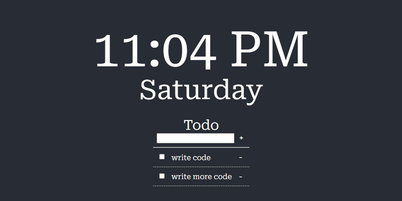

# 📝 Todo List - A todolist app with a time display and Promodoro timer
  
 
| 🔗 [Live](https://tomatodo.netlify.app/)
## Table of Contents
- [📝 Todo List - A todolist app with a time display and Promodoro timer](#-todo-list---a-todolist-app-with-a-time-display-and-promodoro-timer)
  - [Table of Contents](#table-of-contents)
  - [What is This?](#what-is-this)
  - [How to Use](#how-to-use)
    - [Using the Live Version](#using-the-live-version)
    - [Running from Source Code](#running-from-source-code)
    - [Instructions for the App](#instructions-for-the-app)
  - [Why Did I Make It?](#why-did-i-make-it)
  - [Roadmap](#roadmap)
  - [Change Log](#change-log)
  - [License](#license)
  - [Credits](#credits)

## What is This?
This browser-based to-do list app displays a customizable to-do list, the current time, and a Pomodoro timer built with React.js. 

## How to Use
### Using the Live Version
You can use the live version of the application here:
https://tomatodo.netlify.app/

### Running from Source Code
This project requires npm and React.
Navigate to the project's root folder in the terminal, and run 
`npm start` to start the developer build of the website.

### Instructions for the App

**Adding/Deleting tasks in the to-do list:**

type in the input box, and click the "+" button to add to it. It also supports adding by pressing the Enter key.

To mark/unmark a task, click the task or the checkbox.
To delete a task, click the "-" button to the right of the task.

**Using the Pomodoro timer:**
Click on the tomato icon, select a time from the dropdown menu, and click start timer.  

You can toggle the timer setting menu by clicking on the tomato icon. The countdown is still running when you minimize the window.  

## Why Did I Make It?
I use FancyZones from PowerToys to map the windows on my main monitor. And this is my custom grid:  

I use the top left one for YouTube videos for background noise and the right one for the main component (IDE, websites I am debugging, etc.). And that leaves the bottom left part awkwardly showing a part of my desktop and the icons I left on my desktop most of the time. I usually put the Git Bash windows there when I am programming, but what about when I am not programming?  

I have a chrome extension called Momentum. I can technically fit a browser window with an empty tab there, but it doesn't look nice on a smaller window. It was designed as a fullscreen application, after all.  

So it's time for me to write my own!

## Roadmap
+ [ ] Add local storage to save the to-do list and timer
+ [ ] Add a weather widget
+ [ ] Add themes
+ [ ] Add background image support
+ [ ] Add sound for timer

## Change Log
2/27/22 
+ Deploy  app on Netlify
+ Add README.md

## License
This project uses the [MIT License](./LICENSE).

## Credits
**Assets**

<a href="https://www.flaticon.com/free-icons/tomato" title="tomato icons">Tomato icons created by Freepik - Flaticon</a>

